# Agent Body Protocol

Software talks to a body. This lamp thinks. It looks at you.

Agent Body Protocol, built by Rage Industries, for the Autonomous Labs lamp.

Nine events in. Body language out. Power is a parallel contract, not a 10th event.

Packet. Lamp only. Silent. Click a still to watch.

**Coding loop**
You should not have to watch a log.
<a href="docs/demo/abp-loop.mp4">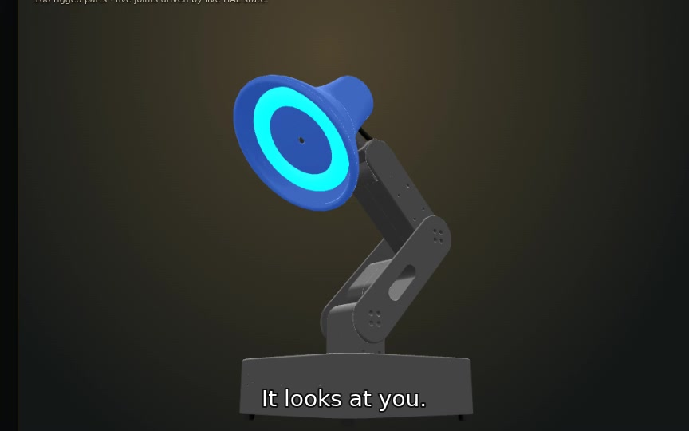</a>
It thinks. / It looks at you. / It failed. / It passed.

**Help**
It asks once. It does not type your password.
<a href="docs/demo/abp-help.mp4">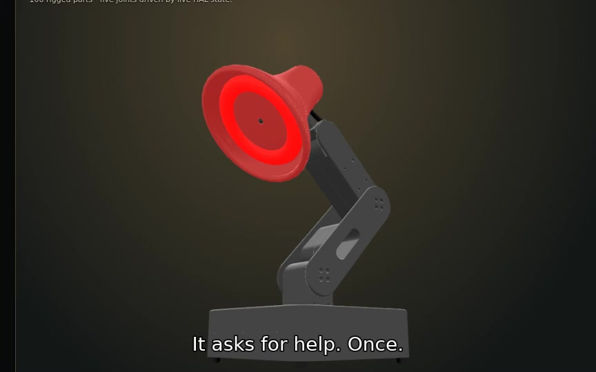</a>
It asks for help. Once.

**Low power**
Tired looks like tired, not like an error.
<a href="docs/demo/abp-low.mp4">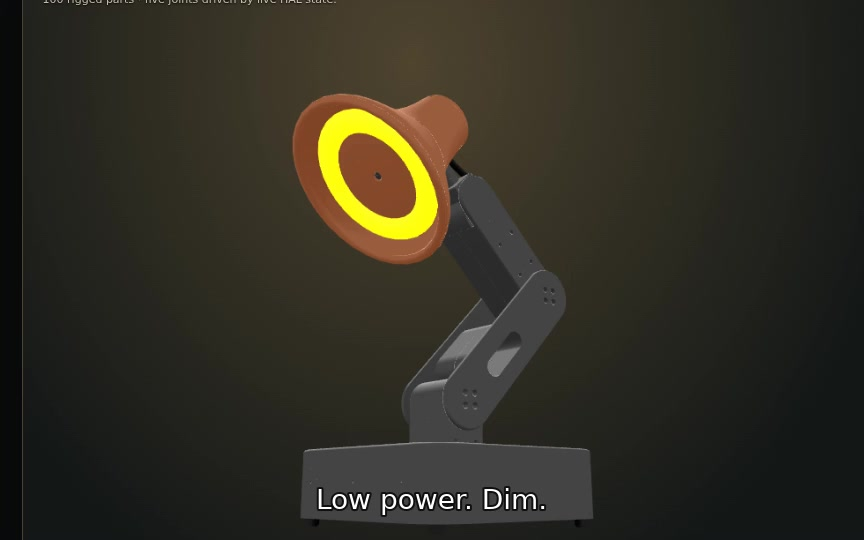</a>
Low power. Dim.

**Look**
It looks at you.
<a href="docs/demo/abp-look.mp4">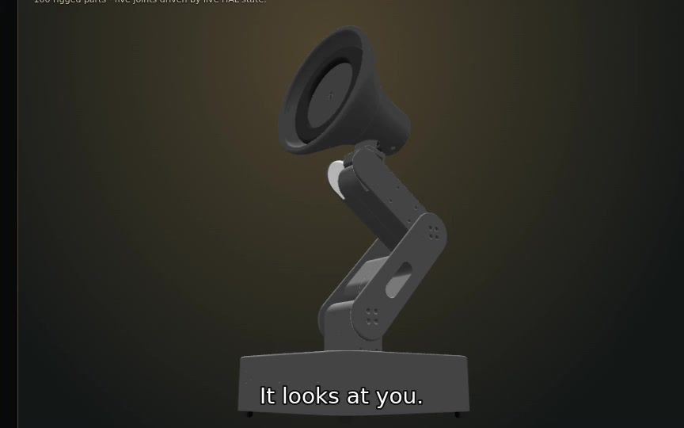</a>
It looks at you.

**Hatch**
After the loop, a hop and a look. Same five joints.
<a href="docs/demo/abp-hatch.mp4">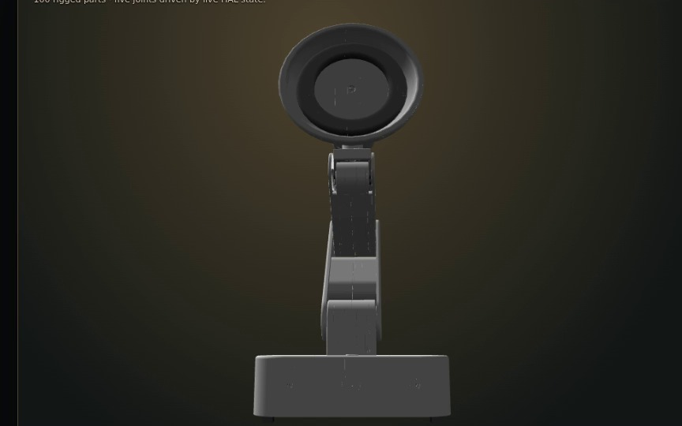</a>
It hops. Then it looks at you.

USB-C — Unplug it and take it with you. No clip until a real unplug exists.

## How to run demos

Loopback only. In Autonomous OS (do **not** run `make sim` or `make hal-dev` from this repo — those binds are not loopback):

```bash
HAL_SIMULATE=1 uvicorn hal.server:app --host 127.0.0.1 --port 5001
```

In this repo:

```bash
export PYTHONPATH=.
python3 -m mapper.agent_body serve --host 127.0.0.1 --port 5051 --hal http://127.0.0.1:5001
```

Open `http://127.0.0.1:5001/simulator`. Fake hook is enough; do not wait on live Claude.

Menu: [`docs/DEMO.md`](docs/DEMO.md)

1. **Coding loop** — You should not have to watch a log. Think, stuck, fail, pass, done — you can see it from across the desk. `scripts/demo_coding_loop.sh`
2. **Help Mode** — It asks once. It does not type your password. `scripts/demo_help.sh`
3. **Low power** — Tired looks like tired, not like an error. `scripts/demo_low.sh`
4. **Qi** — A charging pad is not a dance floor. Unplug it if you want it to move. `scripts/demo_qi.sh`
5. **Hatch** — After the loop, a hop and a look. Same five joints. Character, not a status light. `scripts/demo_hatch.sh`
6. **USB-C** — Unplug it and take it with you. `scripts/demo_usbc.sh`

Hatch CLI: `python3 -m mapper.agent_body skill --name hatch --hal http://127.0.0.1:5001`

Appendix takes (`docs/demo/old/`: story, lab-demo, proof, room) stay in the tree. Do not play them as the packet.

Combined 90s room take (coding loop + help): `scripts/demo_room.sh`. Table proof (no hardware): `scripts/demo_power.sh`. USB-C is spoken/pantomime: unplug and walk; a `/tmp --record` is not unplug-and-go.

Captions (lamp-only recapture, when reshot):

- It thinks.
- It looks at you.
- It failed.
- It passed.
- It asks for help. Once.
- Low power. Dim.
- On a charger. It will not dance.
- It hops. Then it looks at you.

[`docs/demo/old/abp-room.mp4`](docs/demo/old/abp-room.mp4) is the dashboard take / frozen-pose LED slideshow. Appendix only. Not the packet.

Do not run `scripts/demo.sh` on stage (nine-color parade). Honesty: [`docs/HONESTY.md`](docs/HONESTY.md).

## Hackathon

Companion extension for the Autonomous Labs / Autonomous OS hackathon (Autonomous OS Week 5). Rage Industries built the protocol, not the lamp.

**Started.** Nine agent events → lamp body language so you can see think / stuck / fail / pass / done from across the desk. Power as a parallel contract so a wall-plugged lamp can someday leave the brick (voltage track, pack in the base, Qi pad). For this stretch: production-ready docs, lamp-only packet clips, Hatch as a skill (hop then look), not a 10th event.

**Now.** Nine events + hatch skill + power Phase 0 sim (protocol + simulation + LED mapping). Packet clips: loop, help, low, look, hatch (facing the lens). Lamp is still wall-plugged; HAL has no `/power`. No pack, no Qi coil, no ADC in hardware. Sim sources mains | battery | qi | low. Loopback only. Tests prove LED policy — they do not size a cell.

It is meant to go with you, offline: a battery in the base so it can leave the wall, then a pad it sits down on to charge. That path is still a simulation. On a charger, it will not dance (`docs/POWER.md`).

## Marks

Red, black, gray, white. Autonomous Labs. Fun marks, not the packet.

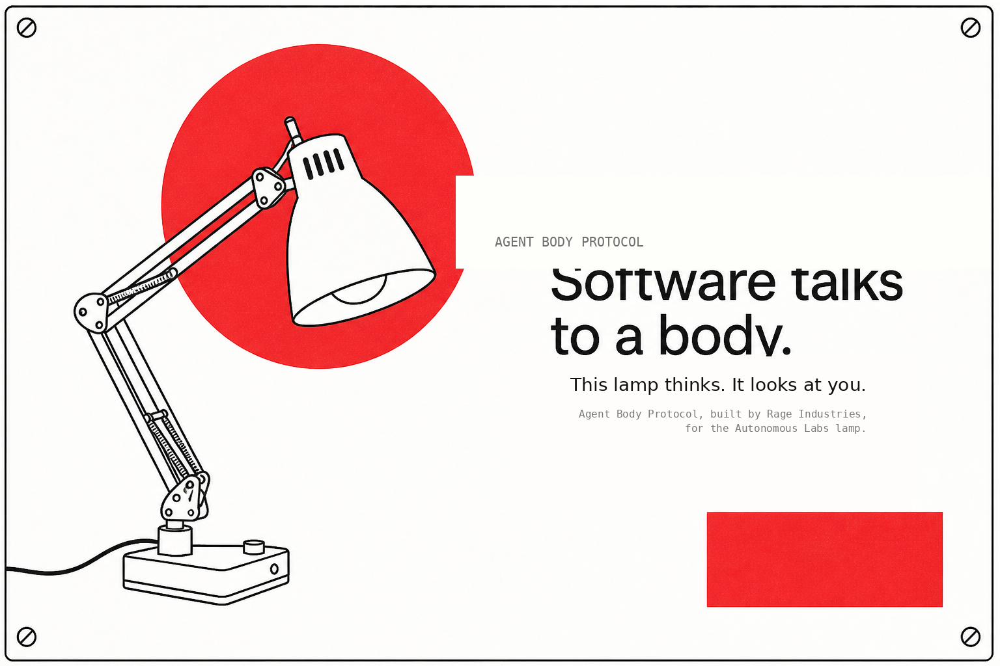

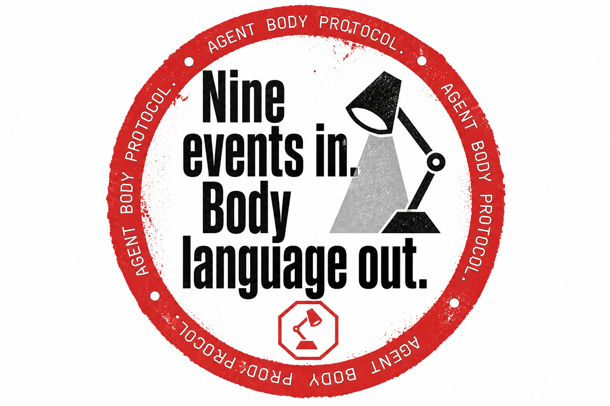

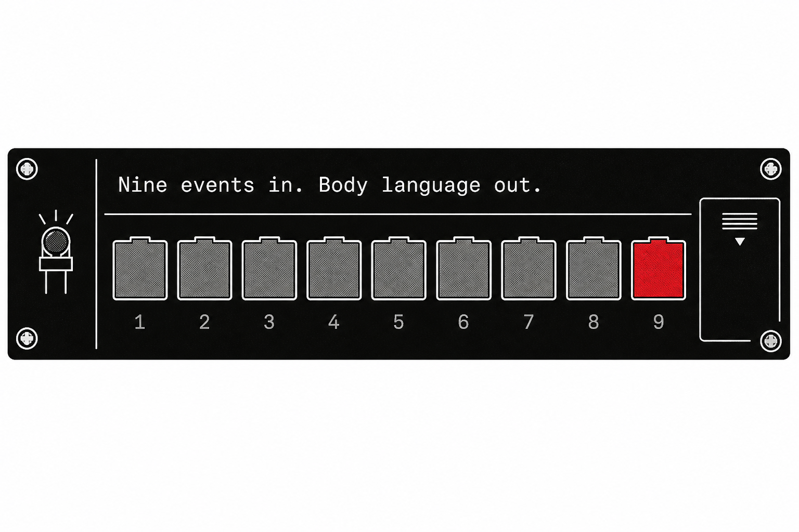

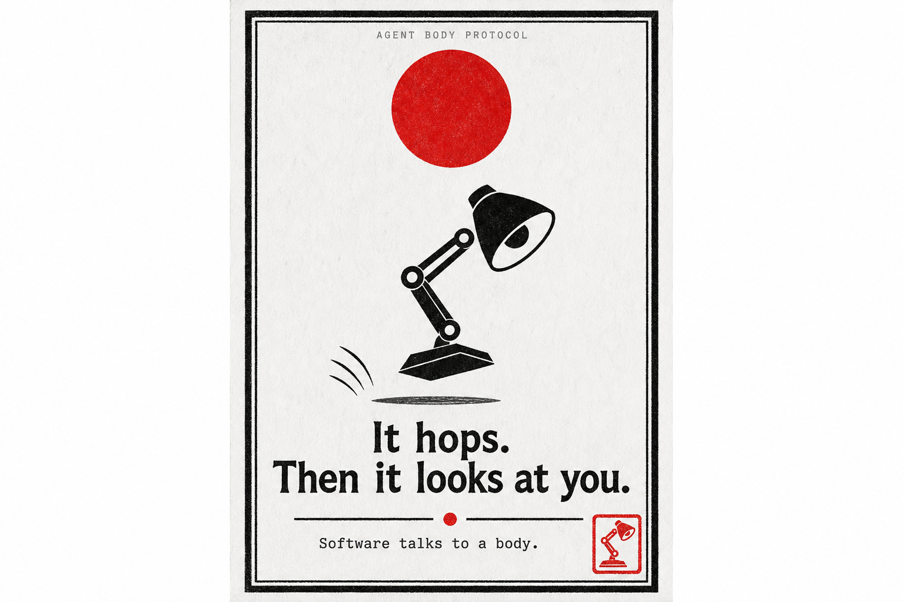

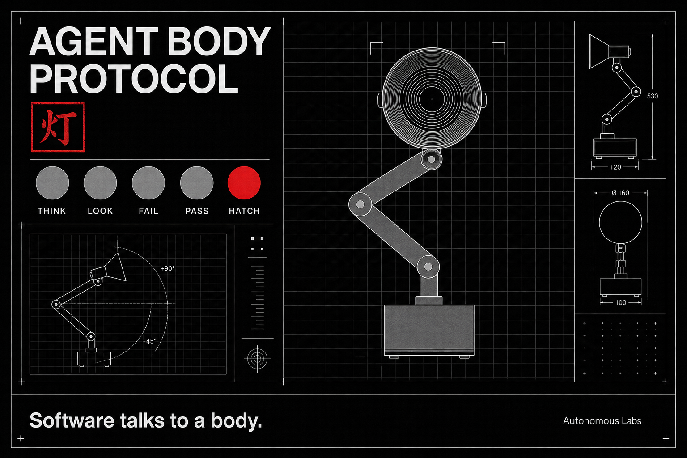


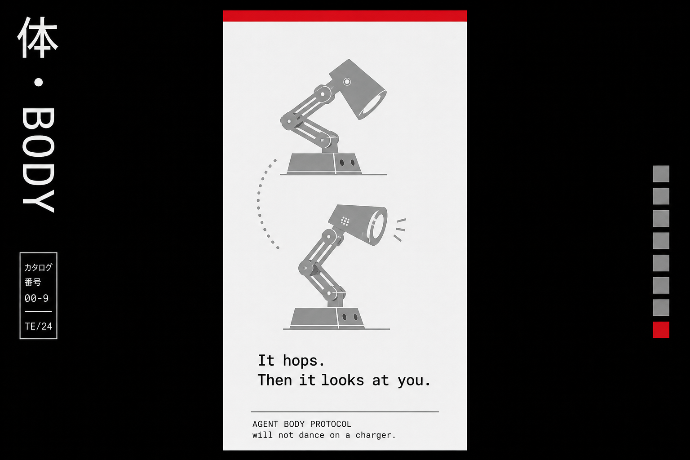

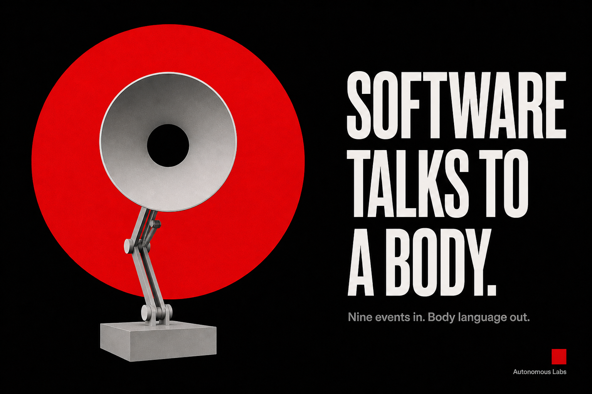

## The contract

- `started` — dim white, silent
- `thinking` — slow blue breathing, silent
- `waiting_for_user` — amber pulse, looks toward user
- `permission_required` — amber attention, asks once
- `blocked` — red diagnostic breathing, offers help once with consent
- `tests_passed` — green, optional two-word report
- `tests_failed` — three red flashes, optional two-word report
- `completed` — short green flourish, silent
- `quiet` — stop speech, restore the user's LED state

Every LED write is transient. Focus/night modes are silent. No mapping drives raw servo pitch.

## Quick proof — no hardware or network

```bash
python3 -m pip install -e '.[test]'
python3 -m mapper.agent_body post --event thinking --record /tmp/thinking.json
python3 -m unittest discover -s tests -q
```

The record contains the exact markers that would be dispatched. Golden files for all nine events live in `fixtures/golden/`.

## Power body

Voltage is a **parallel** contract (`protocol/power.schema.json`), not a 10th agent event. HAL is a robot driver and does not currently expose a battery. Today's Lamp is wall-plugged. This repo ships protocol + simulation; it does not claim HAL already has a pack.

No-hardware table proof: `scripts/demo_power.sh`. Same lamp: `--sim low --hal` dims the head, `skill --name dance --sim qi` and `skill --name hatch --sim qi` refuse. Healthy Qi/USB emit no LED. Path and wattage (~5–15 W idle/trickle): `docs/POWER.md`.

## Live HAL validation

Validated on 2026-08-21 against the Autonomous OS Lamp simulator running live with `HAL_SIMULATE=1` on `127.0.0.1:5001`:

- HAL health: `status=ok`; servo, LED, camera, audio, sensing, voice, TTS, and music reported healthy.
- Simulator page returned `Autonomous Lamp`.
- All nine events dispatched **19 HAL requests; 19 returned HTTP 200**.
- Exact request/response evidence is checked in at `docs/HAL-LIVE.json`.

Re-run the proof with:

```bash
python3 scripts/validate_hal.py http://127.0.0.1:5001
```

## Run against Autonomous OS

Start HAL on loopback (not `make sim`):

```bash
HAL_SIMULATE=1 uvicorn hal.server:app --host 127.0.0.1 --port 5001
```

Then in this repo:

```bash
python3 -m mapper.agent_body post --event started --hal http://127.0.0.1:5001
python3 -m mapper.agent_body post --event thinking --hal http://127.0.0.1:5001
python3 -m mapper.agent_body post --event tests_passed --hal http://127.0.0.1:5001
python3 -m mapper.agent_body skill --name hatch --hal http://127.0.0.1:5001
```

Or start the coalescing loopback mapper:

```bash
python3 -m mapper.agent_body serve --host 127.0.0.1 --port 5051 --hal http://127.0.0.1:5001
curl -s http://127.0.0.1:5051/event \
  -H 'Content-Type: application/json' \
  -d '{"v":1,"event":"blocked","ts":"2026-08-21T18:00:00Z","source":"manual","consent":"ask"}'
```

The v0 server binds to loopback only. Speech is returned to the caller as one optional line; no undocumented HAL speech endpoint is invented.

## Adapters

- `adapters/claude-code/hook.py` maps explicit Claude Code hook payloads.
- `adapters/hermes/mcp_server.py` exposes `agent_body_emit` over stdio MCP.
- Codex/OpenCode use the runtime-neutral `agent-body post` CLI in v0.
- GitHub Actions is documented for self-hosted/LAN runners only. No public tunnel.

## Consent-gated Help Mode

`blocked` is the entry point, not a separate surveillance product.

1. Offer help once; 15-minute cooldown.
2. Continue only after consent.
3. Explain or click non-secret controls.
4. Never read, store, OCR, or type passwords, credentials, tokens, or recovery codes.
5. Never run always-on screen watch.

`tests/test_help_rails.py` fails if any blocked mapping emits credential or typing actions.

## Demos (appendix)

Room menu is at the top of this README. Table proof: `scripts/demo_power.sh`. Architecture: `docs/ARCHITECTURE.md`. Idea file (not the room script): `docs/GIST.md`. Honesty: `docs/HONESTY.md`.

Old VO `docs/demo/old/abp-story.mp4` and `docs/demo/old/story-vo.txt` stay in the tree. They are not the packet.

## Repository map

- `protocol/` — JSON Schema and examples
- `mapper/` — deterministic mapper, state policy, loopback server, HAL client, CLI
- `fixtures/golden/` — exact expected marker sequences
- `skills/` — drop-in Agent Body, work-light, build-scribe, motion-aim, look/follow/dance/hatch/stop
- `adapters/` — Claude Code and Hermes adapters
- `docs/HONESTY.md` — what the demo does and does not prove
- `docs/ARCHITECTURE.md` — mermaid, nouns, layers
- `docs/architecture.html` — dark architecture diagram
- `docs/SIM-TO-REAL.md` — API replay, not Isaac
- `docs/POWER.md` — voltage telemetry, battery/Qi path, table proof via `scripts/demo_power.sh`
- `docs/GIST.md` — idea file; public gist is the same, not the room script
- `docs/brand/` — sequencer, hanko, ofuda, hinomaru marks. Fun, not the lamp packet.

MIT licensed.
