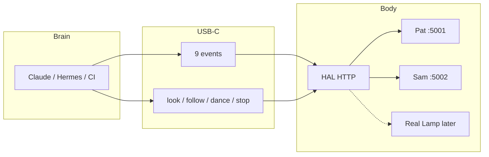
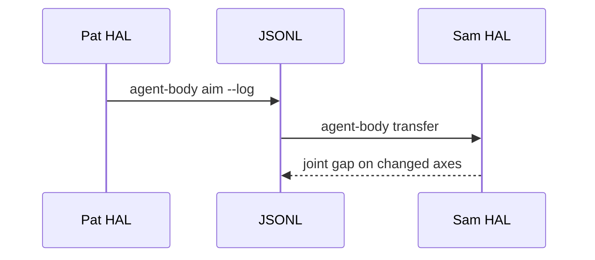
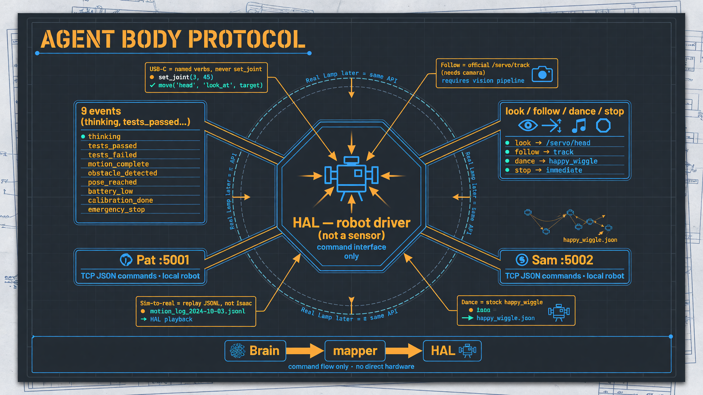

# Architecture

Three layers. Mixing them is how this project gets over-engineered.

## Nouns

| Word | What it actually is |
|---|---|
| HAL | Hardware Abstraction Layer. Robot driver. **Not a sensor.** Same HTTP on sim and metal. |
| Pat | Pretend Lamp A on `:5001`. Demo house, not a product name. |
| Sam | Pretend Lamp B on `:5002`. Same driver, second neck. |
| `/simulator` | 3D preview of that driver. **Not a physics gym.** Not Isaac. |
| Skill | Named verb → existing HAL route. USB-C. Not an RL model. |

## Layers

1. **Brain** — LLM or CI emits one of nine events, or a named skill.
2. **Mapper / skills** — deterministic `[HW:]`. Never `set_joint`. Never type a password.
3. **Body** — HAL executes `/led/*`, `/servo/aim`, `/servo/play`, `/servo/track`.

RL only belongs *inside* a named skill later (how `user` is reached), never as an MCP the LLM twiddles.

## What already exists in Autonomous OS

- Dance → `POST /servo/play` `{recording: happy_wiggle}` (20 stock clips)
- Follow → `POST /servo/aim {direction:user}` then `POST /servo/track {target:["person"]}`
- Look → `POST /servo/aim {direction:user}`
- Stop → `POST /servo/track/stop` then aim `center`

HAL_SIMULATE has no person. `/servo/track` often 500s. That is expected.

## Sim-to-real (what we shipped)

Same `[HW:]`, different body. Exam for a real Lamp. Not training.

## Demo surfaces

- Lab `:5055` — Call Sam + nine events + Look/Follow/Dance/Stop
- Pat `/simulator` `:5001`
- Sam `/simulator` `:5002`
