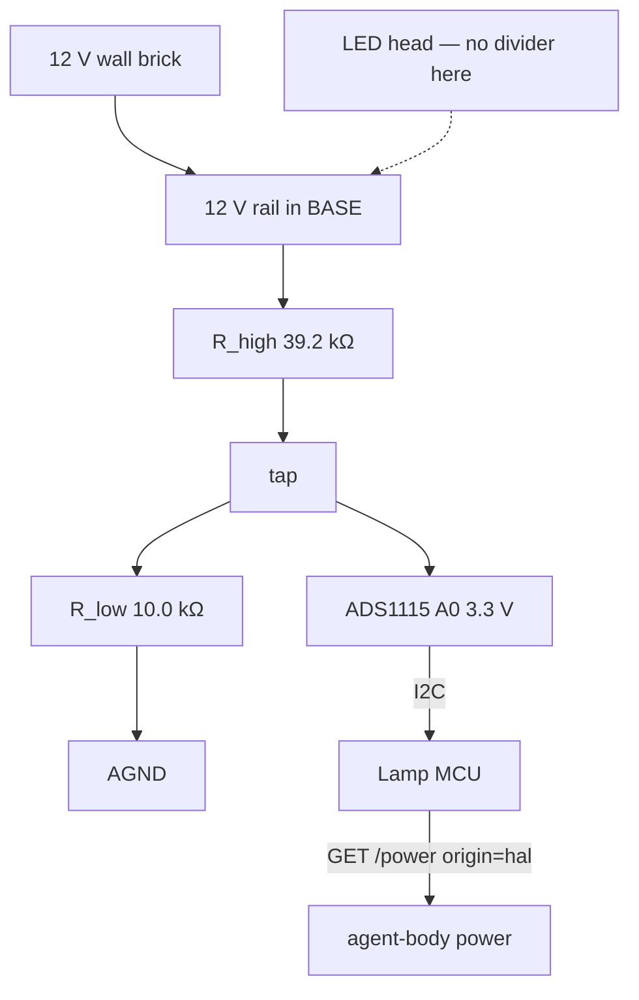
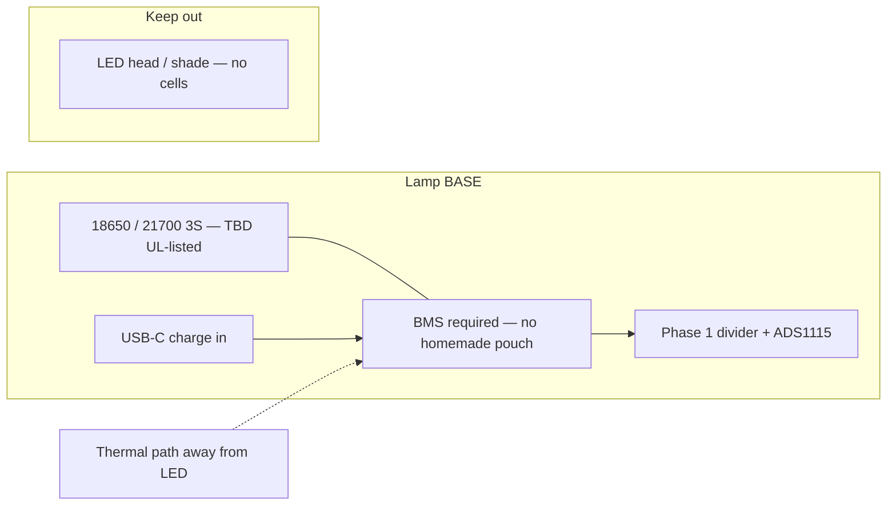
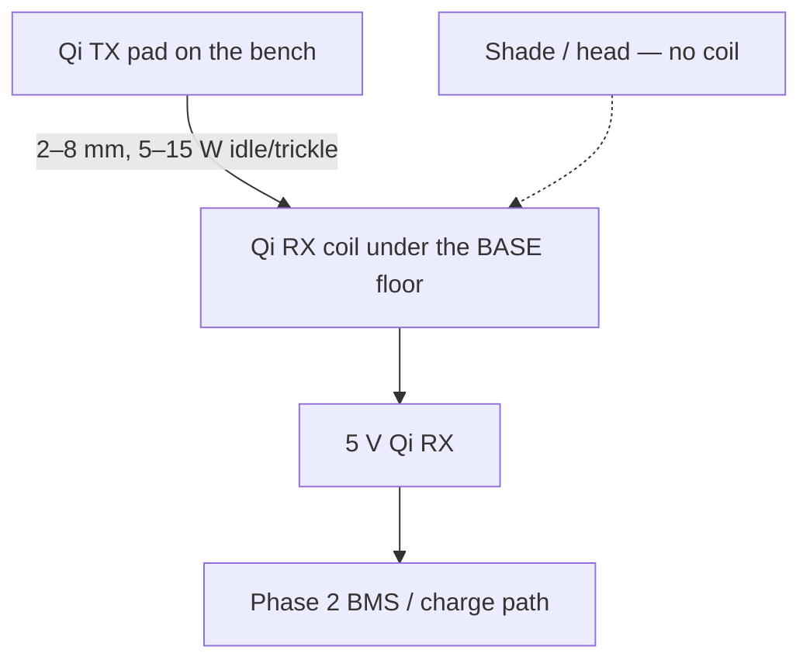

# Power body

The Lamp is still wall-plugged. HAL is a robot driver, **not a battery gauge**. This PR does not add a 10th agent event (`power_low` is not an event). Voltage is a **parallel** contract: `protocol/power.schema.json`, kind `"power"`.

Phase 1 (this PR) is a **voltage divider on the existing 12 V wall rail** into a 3.3 V ADC, in the **base**, plus GET `{hal}/power` and tests. There is no pack in the lamp. There is no Qi coil in the lamp. Do not claim HAL already has a battery. `HAL_SIMULATE` has no `/power`.

Every sample is labeled `origin=sim` or `origin=hal`. Canned 12.0 / 11.1 / 5.0 V voltages are **sim only**. Live GET keeps the HAL numbers (`stamp_hal_origin`). Do not substitute canned 12.0.

## Table proof (no hardware)

Room lead is `docs/DEMO.md` (90s, same lamp, `--sim low --hal`). This section is receipts only. No Lamp, no pad, no network. Runnable copy: `scripts/demo_power.sh`. `--sim mains` is still the demo until HAL grows GET `/power`. `--sim adc` reconstructs mains through the divider and stays `origin=sim`.

```bash
python3 -m pip install -e '.[test]'
python3 -m unittest tests.test_power tests.test_help_rails tests.test_schema tests.test_map -q

# 1. Unplug — leave the wall brick. Mains stays quiet (healthy power = no LED).
agent-body power --sim mains --record /tmp/power-mains.json

# 1b. Phase 1 divider reconstruction. Still origin=sim. Not a live ADC.
agent-body power --sim adc --record /tmp/power-adc.json

# 2. Walk — 3S-ish pack sim, healthy 11.1 V, origin=sim. This is NOT low.
agent-body power --sim battery --record /tmp/power-battery.json

# 3. Pad — drop on Qi. Healthy Qi/USB emit no LED (not white breathing, not dim green). origin=sim.
agent-body power --sim qi --record /tmp/power-qi.json

# 4. Thinking stays blue. Power does not steal the agent LED.
agent-body post --event thinking --record /tmp/thinking.json

# 5. Low dims the head. Reaches fixtures/golden/power-battery-low.json.
agent-body power --sim low --record /tmp/power-battery-low.json
# alias: agent-body power --sim battery-low
```

Say this out loud:

1. **Unplug** — markers empty on mains. The body does not nag about wall power.
2. **Walk** — pack lives in the **base**, later. Healthy 11.1 V is not low. `--sim low` is the overlay.
3. **Pad** — healthy Qi/USB emit no LED.
4. **Thinking stays blue** — `[0,80,255]` breathing. Agent events still win.
5. **Low** — slow dim `[48,16,0]`, **not** `waiting_for_user` amber, **no look-at-user**.

Then the honest line: **stock Qi is ~5–15 W.** Idle/trickle, not a continuous servo dance. `completed` and `skill --name dance` on Qi **refuse `happy_wiggle`**. `skill --name hatch` on Qi **refuses the hop** (`qi-cannot-hatch`). Work sessions still want the pad or USB-C. `HAL_SIMULATE` has no `/power`; `--hal` 404s and the CLI falls back to **labeled** sim.

Optional live fetch (stock HAL today 404; origin stays `sim` with `fallback=hal_unavailable`):

```bash
agent-body power --hal http://127.0.0.1:5001 --sim mains
agent-body skill --name dance --sim qi
agent-body skill --name hatch --sim qi
```

Phase 1 HAL stub (fake ADC count → `voltage_v`, `origin=hal`, `source=mains`). Not stock HAL. Not a pack:

```bash
PYTHONPATH=. python3 scripts/hal_power_stub.py --port 5002
agent-body power --hal http://127.0.0.1:5002 --record /tmp/power-hal-adc.json
```

## What shipped (Phase 1)

- Hardware **drawing** of a 39.2 kΩ / 10.0 kΩ divider on the 12 V rail into a 3.3 V ADC, in the **base**. Math and BOM below. No fake pack.
- `protocol/power.schema.json` — required `{v, kind, ts, voltage_v, source, origin, power_w}`. `power_w` is number or null. Per-source `voltage_v` ranges from `VOLTAGE_RANGE`. Unchanged.
- `mapper/power.py` — divider helpers (`vadc_from_vin`, `vin_from_ads1115_count`, `sample_from_adc_count`). `--sim adc` reconstructs mains through that math and stays `origin=sim`. Canned `--sim mains|battery|qi|low` stay sim.
- `get_power()` is a **GET** of `{hal}/power` then `/sensing/power`. 404 → sim, labeled `origin=sim`. If HAL returns a voltage, `stamp_hal_origin` keeps the live number. `dispatch()` stays POST-only and **refuses** `POST /power`.
- `scripts/hal_power_stub.py` — loopback GET `/power` from a fake ADS1115 count. Default count 20114 ≈ 12.37 V so origin=hal is not canned 12.0.
- Golden fixtures: `power-mains.json`, `power-battery-low.json`, `power-qi.json` (JSON, not a 10th `.markers.txt` event golden). Unchanged.
- Loopback `GET /power` returns the latest posted sample. Bind stays loopback. HAL URLs are loopback-only.

## Hardware path

| Phase | What | Honest status |
|---|---|---|
| 0 | Protocol + sim + LED mapping | Shipped earlier (PR #9 era) |
| 1 | ADC voltage divider on the existing **12 V rail**, still wall-powered | **This PR** — drawing + GET + tests. No ADC soldered in a Lamp by this repo. |
| 2 | 18650/21700 pack + **BMS in the lamp BASE** (not the head). USB-C charge in. | **Drawing only.** Not a pack we built. Cells TBD. |
| 3 | Qi RX coil in the **base** + a Qi TX pad on each bench | **Drawing only.** We did not ship Qi hardware. |

### Phase 1 drawing — divider on the 12 V rail (this PR)

Place the divider in the **BASE**, next to the wall-brick inlet, not in the shade/head.

```
12 V rail ── R_high 39.2 kΩ ──●── R_low 10.0 kΩ ── AGND
                               │
                               └── ADS1115 A0 (3.3 V VDD, I2C to Lamp MCU)
```

First principles:

```
Vadc = Vin * R_low / (R_high + R_low)
```

30 kΩ / 10 kΩ is the class (tens of kΩ, ~3:1). At 14 V that is **3.50 V**, which exceeds a 3.3 V ADC. Tighten to E96 1% **39.2 kΩ / 10.0 kΩ** (ratio 10/49.2 ≈ 0.203252):

| Vin | Vadc | ADS1115 count (FS ±4.096 V, LSB 125 µV) | Margin below 3.3 V |
|---|---|---|---|
| 11.0 V | 2.236 V | 17886 | 1.064 V |
| 12.0 V | 2.439 V | 19512 | 0.861 V |
| 14.0 V | 2.846 V | 22764 | 0.454 V |

`voltage_v = Vadc * 49.2 / 10`. ESP ADC is not trusted (nonlinear). Named ADC: Adafruit ADS1115 (product 1085). Analog pin must stay under VDD; we run it at 3.3 V so the 14 V row has to clear 3.3 V, which 39.2k/10k does.



#### Phase 1 BOM (fetched 2026-08-26 from adafruit.com; do not invent prices)

| Qty | Item | Role | SKU | Price | URL |
|---|---|---|---|---|---|
| 1 | ADS1115 16-bit ADC, 4-ch, PGA | Named ADC (ESP ADC not trusted) | Adafruit 1085 | $14.95 | https://www.adafruit.com/product/1085 |
| 1 | 39.2 kΩ ±1% 1/4 W metal film | R_high | TBD | TBD | 1% SKU not fetched live |
| 1 | 10.0 kΩ ±1% 1/4 W metal film | R_low | TBD | TBD | 1% SKU not fetched live |
| 1 pack | 47 kΩ 5% 1/4 W (pack of 25) | Lab stand-in for R_high (more margin, worse accuracy) | Adafruit 2786 | $0.75 | https://www.adafruit.com/product/2786 |
| 1 pack | 10 kΩ 5% 1/4 W (pack of 25) | Lab stand-in for R_low | Adafruit 2784 | $0.75 (listed; out of stock on fetch day) | https://www.adafruit.com/product/2784 |

47 kΩ / 10 kΩ at 14 V → 2.456 V (0.844 V margin). Fine for a breadboard. The protocol math and `--sim adc` use **39.2 kΩ / 10.0 kΩ**. Existing MCU ADC is allowed if you trust it; this repo names ADS1115 because we do not.

### Phase 2 drawing — pack in the BASE (not this PR)

Not a claim we built a pack. Move between benches with a cable. Do not put cells in the shade.



Exploded occupancy (bottom → top), also `docs/hardware/base-exploded.scad`:

1. Base floor (later: Qi RX coil under here — Phase 3)
2. 3S cells + BMS, thermal mass in the base
3. Phase 1 divider + ADS1115 on the 12 V / pack rail
4. USB-C jack on the base rim
5. Column up to the LED head — **empty of cells**

#### Phase 2 BOM (drawing; fetched 2026-08-26)

| Qty | Item | Role | SKU | Price | URL |
|---|---|---|---|---|---|
| 3 | 18650 or 21700 cells | Energy | TBD | TBD | No UL-listed pack picked. TBD is better than fiction. |
| 1 | 3S BMS with balance, cutoff, thermal | Required. No series-cells-with-tape. | TBD | TBD | No UL-listed 3S BMS fetched from a catalog we will stand behind. |
| 1 | USB Type C breakout, downstream | Charge **connector** only. Not a 3S charger. | Adafruit 4090 | $2.95 | https://www.adafruit.com/product/4090 |
| 1 | 3S CC/CV USB-C PD sink / charger | Charge path | TBD | TBD | 4090 is 5 V / 1.5 A sink indication, not 12.6 V CC/CV. |

A real BMS owns cutoff, balancing, and thermal. `soc_from_voltage` stays a 3S OCV table for sim. It is **not a BMS**.

### Phase 3 drawing — Qi coil under the base (not this PR)

We did not ship Qi hardware. Stock Qi is about **5–15 W**. Idle/trickle. Still refuse dance/hatch on `source=qi`.



Coil faces the bench. Not a product page. Adafruit 1901 is a 5 V / 500 mA (~2.5 W) RX module; 2162 is a ~5 W TX. That is the low end of stock Qi, useful as a **reference drawing**, not a Lamp we built.

| Qty | Item | Role | SKU | Price | URL |
|---|---|---|---|---|---|
| 1 | Universal Qi Wireless Receiver Module | RX coil + rectifier in the base | Adafruit 1901 | $14.95 | https://www.adafruit.com/product/1901 |
| 1 | Universal Qi Wireless Charging Transmitter | TX pad on the bench (~5 W) | Adafruit 2162 | $26.95 | https://www.adafruit.com/product/2162 |

1901 is 5 V 500 mA. Protocol wattage is 5 or 10 W sim, 5–15 W stock. Do not oversell these SKUs as a 15 W dance floor.

### Voltage ranges (LED policy, not cutoff)

`validate_power` and the schema consult `VOLTAGE_RANGE` in `mapper/power.py`. 5 V mains is rejected, not treated as low.

| `source` | Bus | Normal | Notes |
|---|---|---|---|
| `mains` | 12 V wall rail | 11.0–14.0 V | 5 V is **invalid**, not mains-low |
| `battery` | 3S pack | 9.0–12.6 V | LED-low if `< 10.5 V` or `soc_pct < 15` (battery-only) |
| `qi` | 5 V Qi RX | 4.5–5.5 V | 5.0 V is **normal**, not low |

`soc_from_voltage` is a **3S OCV lookup table** for sim. It is **not a BMS**. No current. No temperature. `low` is an **LED overlay**, not a pack cutoff. Inferred `soc_pct` low-policy is **battery-only**. A real BMS (Phase 2) owns cutoff, balancing, and thermal.

### Qi wattage (do not oversell)

Stock Qi is about **5–15 W**. Sim uses **5 or 10 W**. Mains `power_w` is required and may be null. Enough to hold idle LEDs and trickle a pack. **Not** enough for continuous servo dance, Follow, or `happy_wiggle` as a primary load. Mapper **refuses the wiggle** when `source=qi` (`completed` and `skill --name dance`). Hatch also refuses (`qi-cannot-hatch`). A work session still wants the pad underneath or USB-C.

### Safety (do not ship fiction)

- Use a **BMS**. No homemade pouch packs. No series-cells-with-tape.
- Thermal path in the **base**, away from the LED head.
- Do not describe a UL-unreviewed pack as done. Phase 2/3 are drawings, not a product.
- Do not say HAL already has a battery. Do not say we shipped Qi hardware.

## Mapping (deterministic)

| State | Body |
|---|---|
| `low` | Slow dim solid `[48,16,0]`. No `/servo/aim`. Not `waiting_for_user` amber. |
| Healthy Qi / USB-C docked / mains | No extra LED |
| `thinking` + any power | Stays blue. Power does not steal the agent LED. |
| `completed` + `source=qi` | LED flourish only. No `happy_wiggle`. |
| `skill --name dance` + `source=qi` | No `happy_wiggle`. |
| `skill --name hatch` + `source=qi` | No hop. `markers=[]`. `qi-cannot-hatch`. |

Power is **read** telemetry. `get_power` GETs `{hal}/power` then `/sensing/power`. 404 → sim, labeled `origin=sim`. `dispatch()` never POSTs `/power`.
