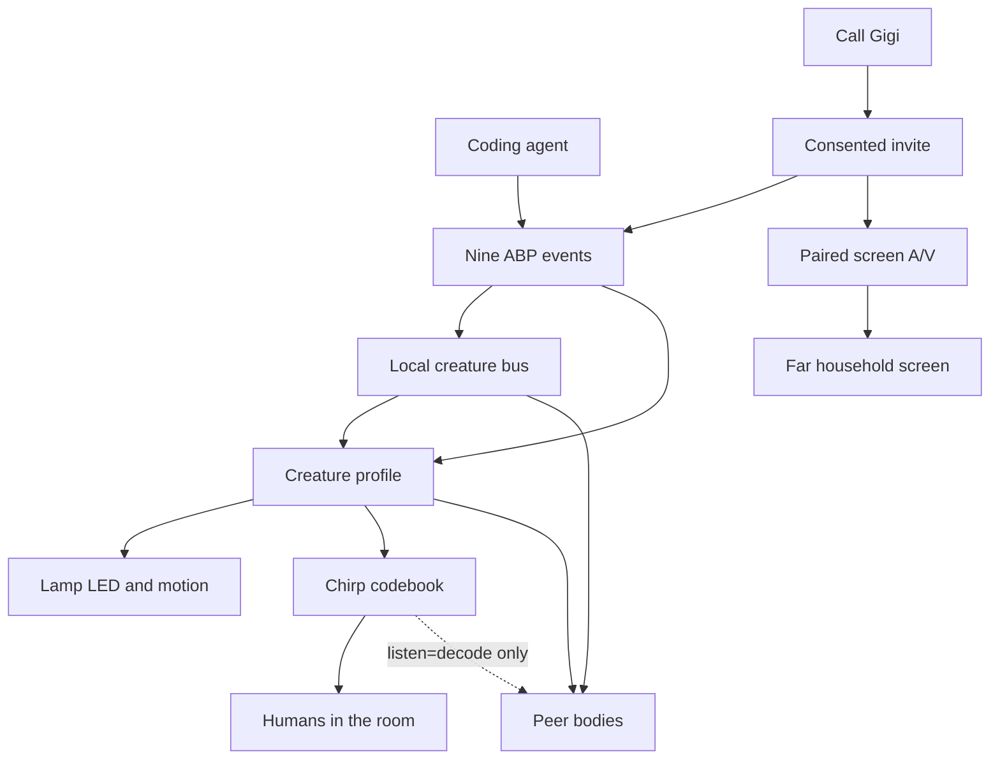

# ABP Creature Bus - Plan

## Goal Capsule

- **Objective:** One nine-event language for coding-agent bodies, house peers, and a consented family call. Lamp rings and looks. A paired screen carries video. Chirps stay a closed codebook. Personalities stay knobs.
- **Product authority:** Companion repo `agent-body-protocol`. Public v0 remains the nine-event Lamp mapper. This chapter is not tonight's grant claim.
- **Open blockers:** None that block planning. Second-body identity and real house-to-house transport are deferred.

## Product Contract

### Summary

Keep the nine events as the only semantic language.
Add a local creature bus, a quantified chirp render, Interstellar-style profile knobs, and a consented family-call skill.
The Lamp is the creature that rings. A paired screen is the FaceTime surface. Video never rides the event bus.

### Problem Frame

v0 makes one Lamp look like one coding agent.
The house already has more than one possible body, and Dee's thesis is that different brains become different creatures.
If the second body speaks English, we recreate the chatty narrator problem.
If robots only understand each other by listening to the room, kids, TVs, and false chirps become the protocol.
The movie move that actually works is TARS: a short personality dial on a clipped, countable language, not a new soul.
A second household Lamp is the human reason to care. People will not buy a protocol. They will buy "call Gigi" if the Lamp rings like a creature and the video opens on a screen they already look at.
Lamp health reports no display. Forcing a FaceTime rectangle onto the shade makes a tablet on a stick and loses the grant.

### Key Decisions

- **One language, two channels.** Wire carries meaning whenever it is available. Chirps are a deterministic render of the same event. Acoustic decode is opt-in per creature, never a replacement for the bus.
- **Wire wins.** If a decoded chirp and a bus event disagree inside a short collision window, the bus event is kept and the chirp is ignored.
- **Personalities are render policy.** Humor, honesty, and listen are knobs on the existing mapper policy. They are not a character LLM, movie quotes, or a new event enum.
- **Room has one speaker of record.** Two bodies in the same room do not both chirp the same event. Presence elects one audible renderer.
- **Closed codebook, not warble-to-LLM.** A chirp is an ordered list of tones with frequency, duration, and gap. Decode, if enabled, matches that codebook. It does not transcribe free audio.
- **v0 grant story stays frozen.** Tonight's Dee post and the public README still claim nine events on one Lamp. This chapter does not ship in that post.
- **Call is a skill, not a tenth event.** Invite, accept, decline, and hangup are call signaling. Each side maps them onto the existing nine events locally.
- **Lamp rings. Screen shows faces.** Video and two-way speech open on a paired household screen. The Lamp may offer its camera as an optional consented eye. It is not the FaceTime chrome.
- **No public family faces.** Hackathon and X use synthetic contacts and two sims. Real Gigi calls stay private and off the grant reel.

### Actors

- A1. Human in the room. Learns nine sounds the way they learn traffic lights.
- A2. Primary body. Usually the Lamp. Renders LED, motion, and optional chirps.
- A3. Peer body. Puck, Reachy, a second Lamp, or a sim. Subscribes to the same events.
- A4. Coding agent. Still emits only the nine events. It does not compose chirps or pick humor per turn.
- A5. Far household human. Same consent rules. Never named in public fixtures.
- A6. Paired screen. Household iPad, TV, Buddy Mac, or private hub page. Owns the call UI.

### Requirements

**Language**

- R1. The semantic vocabulary stays the existing nine events. No new event names for robot-to-robot talk.
- R2. Every bus message names sender, optional target, room, event, and timestamp.
- R3. Broadcast in a room is allowed. Driving another body's servos, LEDs, or typed input over this bus is forbidden.

**Channels**

- R4. Each creature has `listen` of `off`, `human`, or `decode`. Default is `human`.
- R5. `human` plays chirps for people and never treats room audio as protocol.
- R6. `decode` may accept a codebook match from another body only when no contradictory bus event arrives in the collision window.
- R7. `off` is silent and does not decode.
- R8. Night and focus remain silent regardless of humor or listen.

**Chirp lexicon**

- R9. Each event maps to one ordered tone sequence. Each tone has frequency in Hz, duration in ms, and gap in ms.
- R10. The codebook is small enough to learn. Nine events, at most three honesty or intensity variants, no free melody.
- R11. Humor only adds or removes optional flourish notes after the canonical sequence. It never changes the identifying prefix of an event.
- R12. Honesty never maps a failed or mixed test result to the passed chirp. High honesty may lengthen or lower the failed sequence. It may not sweeten it.
- R13. Virtual or simulated audio may record the sequence without playing a speaker. A silent sim is not a failed lexicon.

**Creature profile**

- R14. Humor is an integer 0–100. Zero is clipped TARS. One hundred may add a short completed flourish only.
- R15. Honesty is an integer 75–100. It cannot be set below 75. The mapper already fail-closes mixed tests; honesty must not undo that.
- R16. Profiles are per body, not per agent turn. A Claude session and a Hermes session on the same Lamp share that Lamp's profile.
- R17. Different bodies may use different profiles for the same event. That is how two creatures stay distinct.

**House fit**

- R18. The creature bus is not house-bus telemetry and not house-bus verbs. Env sensors stay on their own topics. Deny-by-default actuation stays deny.
- R19. Help Mode stays consent-gated and never types or stores passwords, including when a peer body is present.

**Family call**

- R20. A wake phrase such as call plus a household contact starts a local confirm, then a consented invite. It does not open media first.
- R21. Outbound confirm and inbound ring both render as `permission_required` plus the waiting chirp prefix. The Lamp looks toward the user.
- R22. Accept opens the paired screen and sets local mode so coding-agent events do not chirp over the call. Decline and hangup emit `quiet`.
- R23. Video, mic, and speaker for the conversation live on the paired screen. The Lamp camera is off unless both households opt in for that session.
- R24. Call media is not published on the creature bus, house-bus, or ABP events. No MJPEG over MQTT.
- R25. Contacts are local nicknames. Public fixtures use synthetic names only. Family names, kid faces, and real call video stay off GitHub, X, and the grant reel.
- R26. Night mode still rings as light-only unless the household has set an allowed-contacts exception. Default is light-only, no chirp, no speech.
- R27. Always-on watch and unsolicited outbound calls are forbidden. No recording unless both sides enable it for that session.
- R28. Hackathon proof is two sims: ring, amber, one ask, accept or decline, stub screen. It does not require a real second house.

### Key Flows

- F1. Two bodies, wire available
  - **Trigger:** A coding agent emits `tests_failed`.
  - **Actors:** A2, A3, A1
  - **Steps:** Event hits the bus. Speaker of record shows red and plays the failed codebook. Peer updates its own quieter render or stays dark. Human hears one failed chirp, not a chorus.
  - **Covered by:** R2, R3, R8, speaker-of-record decision
- F2. Peer with `listen=decode` and no bus
  - **Trigger:** Isolated body hears a valid passed codebook and no bus event in the collision window.
  - **Actors:** A3
  - **Steps:** Body accepts `tests_passed` as if posted locally. It does not re-chirp unless it is speaker of record.
  - **Covered by:** R6, R11
- F3. Collision
  - **Trigger:** Decoded `tests_passed` arrives while the bus says `tests_failed`.
  - **Actors:** A2
  - **Steps:** Bus wins. Passed chirp is ignored. Honesty path stays failed.
  - **Covered by:** R6, R12, R15
- F4. Humor zero vs humor high
  - **Trigger:** `completed` after a quiet period in normal mode.
  - **Actors:** A2, A1
  - **Steps:** Both play the same completed prefix. Humor 0 stops there. Humor 100 may add flourish notes. Prefix remains identifiable.
  - **Covered by:** R11, R14
- F5. Call Gigi
  - **Trigger:** Human says the household wake phrase for a saved contact.
  - **Actors:** A1, A2, A5, A6
  - **Steps:** Local Lamp asks once. On yes, invite goes to the far house. Far Lamp amber-pulses and looks up. Far human accepts on the paired screen. Screens carry A/V. Both Lamps go quiet-body for the call. Hangup restores.
  - **Covered by:** R20, R21, R22, R23, R24
- F6. Decline and night
  - **Trigger:** Inbound invite while mode is night and the contact is not excepted.
  - **Actors:** A2, A1
  - **Steps:** Dim amber only. No chirp. No speech. Timeout emits `quiet`. No screen opens.
  - **Covered by:** R8, R22, R26

### Acceptance Examples

- AE1. **Covers R6, R12.** **Given** a TV in the room and `listen=decode`. **When** a random major arpeggio plays that is not the codebook. **Then** no body emits `tests_passed`.
- AE2. **Covers R11, R14.** **Given** humor 0 and humor 100 on two bodies hearing the same `completed`. **When** both are allowed to sound in isolation. **Then** a decoder that only knows the prefix classifies both as `completed`.
- AE3. **Covers R8.** **Given** mode `night` and humor 100. **When** `completed` fires. **Then** no chirp and no speech.
- AE4. **Covers R3, R19.** **Given** a peer body and `blocked` with a password screen fixture. **When** help is offered. **Then** no type command and no credential fields leave either body.
- AE5. **Covers R13.** **Given** HAL virtual audio. **When** `thinking` is mapped. **Then** the recorded tone sequence matches the codebook even if the speaker is silent.
- AE6. **Covers R20, R23.** **Given** the wake phrase and no confirm yet. **When** the skill starts. **Then** no camera stream, no mic, and no paired screen open.
- AE7. **Covers R25.** **Given** the public repo and grant reel. **When** fixtures and README are inspected. **Then** no household names and no real faces.
- AE8. **Covers R24, R22.** **Given** an active call. **When** a coding agent emits `thinking`. **Then** the Lamp does not chirp or speak over the call.

### Success Criteria

- A human can name all nine chirps after one sitting with the contact sheet plus audio.
- A second body can follow a first body's state from the bus with no English spoken.
- Decode can be turned off on a kids-room body without changing the Lamp profile.
- Two sims can show ring → ask → accept or decline without a real second house.
- Public v0 README still does not claim a shipped inter-robot language or a shipped family video product.

### Scope Boundaries

**Deferred for later**

- Choosing the actual second house body.
- GitHub Actions over the creature bus.
- Continuous pitch slides. v1 is stepped tones because that is what a tone player can emit honestly.
- Shared dances or coordinated servo scenes.
- Real Tailscale or cloud media to a second physical house.
- Lamp camera as the default eye.

**Outside this product's identity**

- A new 76-method gateway or Grok runtime.
- Freeform R2 impressions generated by an LLM.
- Robots holding spoken conversations with each other.
- Acoustic-only mesh as the default house protocol.
- House-bus relay actuation.
- Claiming Interstellar likeness or Disney/Lucas marks in public copy.
- A tablet-on-a-stick Lamp with FaceTime chrome on the shade.
- Always-on grandparent baby-monitor.
- Public video of family, kids, or real call sessions.

### Dependencies / Assumptions

- v0 nine-event contract, quiet policy, and help rails stay the base.
- Autonomous Lamp can play discrete tones on real speakers and no-ops them in virtual audio.
- House MQTT or an equivalent local bus can carry small JSON without becoming a command channel.
- Default assumption: first peer is another sim or a second process, not a new purchased robot.

### Outstanding Questions

**Deferred to Planning**

- Exact Hz/ms table for the nine prefixes.
- Collision window length.
- How speaker-of-record is elected.
- Whether the bus reuses Autonomous OS MQTT or a loopback-only topic in this repo first.
- Which owned body is the first peer.
- Which household screen is the first paired surface.
- Invite transport for a real second house.
