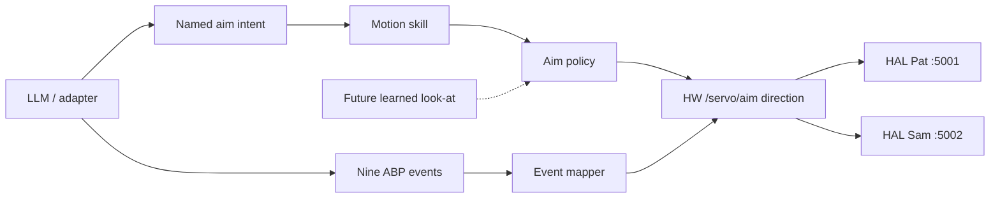

# ABP Motion Skill - Plan

## Goal Capsule

- **Objective:** Let a later learned look-at live *behind* `/servo/aim` without giving an LLM a joint MCP.
- **Product authority:** Companion repo `agent-body-protocol`. Public v0 stays nine events. This is not the grant tweet.
- **Open blockers:** None for the contract. Training data and a physics env are out of scope.

## Product Contract

### Summary

Nine events remain the only semantic language.
Motion is a skill: named intents (`user`, `center`, `left`, `right`, `desk`, `up`, `down`, `wall`) map to existing HAL aim presets.
A future RL / IK policy may replace *how* `user` is reached. It may not add events, expose `set_joint`, or accept raw pitch from a model.

### Problem Frame

Two real HAL sims now exist. The temptation is to let an LLM or an RL MCP drive five joints.
That destroys goldens, Help Mode rails, and the “same event, two bodies” story.
Their HAL already owns named aims and SAFETY clamps. We should consume that, not fork it.

### Key Decisions

- **Events stay discrete.** No `look`, `track`, or `dance` event.
- **LLM talks intents, never angles.** Hermes/Claude may call `agent-body aim --direction user`. They may not pass `wrist_pitch`.
- **Default policy is named HAL aim.** `[HW:/servo/aim:{"direction":"user"}]`.
- **Learned policy is a slot.** Same input (named direction + optional observation handle). Same output (one allowed marker). Swap later without touching adapters.
- **No Isaac this chapter.** No MuJoCo. No sim-to-real claim. Observations, if any, come from live HAL `/simulator/state` and `/servo/position` as *evidence*, not as a training env.
- **No `set_joint` MCP.** Ever, in v1 of this skill.
- **Quiet / night still win.** Aim may run. Extra flourish recordings do not run in `focus` or `night`.
- **Two lamps stay independent.** Pat `:5001` and Sam `:5002` each aim locally. One body never writes the other’s servos.

### Actors

- A1. Coding agent. Emits events. May request a named aim. Never sets joints.
- A2. Motion skill. Validates intent, picks policy, emits one allowed marker.
- A3. Default policy. HAL named presets.
- A4. Future learned policy. Same interface. Trained offline. Loaded explicitly.
- A5. HAL SAFETY. Still clamps speed and LED. Skill does not bypass it.

### Requirements

**R1.** Allowed directions are exactly HAL `AIM_PRESETS` keys: `center`, `desk`, `wall`, `left`, `right`, `up`, `down`, `user`.
**R2.** Default emit is `[HW:/servo/aim:{"direction":"<name>"}]` with no extra joint fields.
**R3.** A policy implementation that returns raw `base_yaw` / `wrist_pitch` / `/servo/set` fails closed in tests.
**R4.** `agent-body aim` is the only new CLI. It is not an event and not an MCP tool family.
**R5.** Adapters do not gain `set_joint`, `nudge`, or `play_recording` tools in this chapter.
**R6.** Learned weights are off unless `ABP_AIM_POLICY=learned` and a registered module exists. Missing module → named fallback, never a crash-loop of random joints.
**R7.** No training job, dataset, or reward function ships in this chapter.
**R8.** Grant / X copy still claims nine events only.

### Non-goals

- Training an RL look-at.
- Isaac / MuJoCo / real-to-sim.
- MCP that exposes five DOF.
- Shared dances across lamps.
- FaceTime on the shade.

### Success

- Tests refuse any joint payload from the motion skill.
- `agent-body aim --direction user` records the same marker the event mapper already uses for `waiting_for_user`.
- README / HONESTY say this is a slot, not a trained creature.
